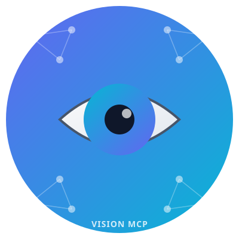
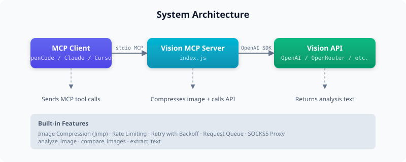

<p align="center">
  <picture>
    <source media="(prefers-color-scheme: dark)" srcset="assets/logo.svg">
    
  </picture>
</p>

<h1 align="center">Vision MCP Server</h1>

<p align="center">
  <a href="LICENSE"></a>
  <a href="https://nodejs.org"></a>
  <a href="https://github.com/Winterfellwen/vision-mcp"></a>
  <a href="https://modelcontextprotocol.io"></a>
  <a href="i18n/README.zh-CN.md"></a>
</p>

<p align="center">
  Analyze, compare, and extract text from images via any OpenAI-compatible API.<br>
  Works with <b>OpenAI</b> · <b>OpenRouter</b> · <b>Together</b> · <b>Groq</b> · <b>and more</b>
</p>

<p align="center">
  
</p>

## Tools

### `analyze_image`

| Parameter   | Type   | Required | Default                                    | Description                     |
|-------------|--------|----------|--------------------------------------------|---------------------------------|
| `imagePath` | string | yes      | —                                          | URL or local file path          |
| `query`     | string | no       | `"Describe this image in detail."`          | Custom question about the image |

### `compare_images`

| Parameter | Type   | Required | Default                                                      | Description                        |
|-----------|--------|----------|--------------------------------------------------------------|------------------------------------|
| `image1`  | string | yes      | —                                                            | First image URL or local path      |
| `image2`  | string | yes      | —                                                            | Second image URL or local path     |
| `query`   | string | no       | `"Compare these two images and describe their differences."` | Custom comparison question         |

### `extract_text`

| Parameter   | Type   | Required | Default                                   | Description                   |
|-------------|--------|----------|-------------------------------------------|-------------------------------|
| `imagePath` | string | yes      | —                                         | URL or local file path        |
| `prompt`    | string | no       | `"Extract all text from this image."`      | Custom OCR prompt             |

## Quick Start

```bash
git clone https://github.com/Winterfellwen/vision-mcp.git
cd vision-mcp
npm install
VISION_API_KEY=sk-... node index.js
```

The server listens on **stdio** (standard MCP transport). Connect it to your MCP-compatible client.

## Configuration

All settings are configured via environment variables:

| Variable                 | Default       | Description                                           |
|--------------------------|---------------|-------------------------------------------------------|
| `VISION_API_KEY`         | —             | API key **(required)**                                |
| `VISION_MODEL`           | `gpt-4o-mini` | Vision model ID                                       |
| `VISION_API_URL`         | OpenAI default | API base URL (e.g. `https://api.openai.com/v1`)      |
| `VISION_RATE_LIMIT_RPM`  | `20`          | Rate limit (requests per minute)                      |
| `VISION_IMAGE_MAX_DIM`   | `768`         | Max image dimension in pixels                         |
| `VISION_IMAGE_QUALITY`   | `70`          | JPEG compression quality (1–100)                      |
| `VISION_PROXY_ENABLED`   | `true`        | Enable SOCKS5 proxy                                   |
| `VISION_PROXY_URL`       | —             | SOCKS5 proxy URL (e.g. `socks5://127.0.0.1:10808`)    |
| `VISION_TIMEOUT`         | `120000`      | API request timeout (ms)                              |
| `VISION_MAX_RETRIES`     | `5`           | Max retry attempts on transient errors                |
| `VISION_RETRY_DELAY`     | `2000`        | Initial retry backoff (ms)                            |
| `VISION_RETRY_MAX_DELAY` | `15000`       | Max retry backoff (ms)                                |

## Providers

Works with any OpenAI-compatible API:

| Provider   | `VISION_API_URL`                          | Example Model                                        |
|------------|-------------------------------------------|------------------------------------------------------|
| OpenAI     | `https://api.openai.com/v1`               | `gpt-4o-mini`, `gpt-4o`                              |
| OpenRouter | `https://openrouter.ai/api/v1`            | `nvidia/nemotron-nano-12b-v2-vl:free`                |
| Together   | `https://api.together.xyz/v1`             | `meta-llama/Llama-3.2-11B-Vision-Instruct-Turbo`    |
| Groq       | `https://api.groq.com/openai/v1`          | `llama-3.2-90b-vision-preview`                       |
| Any        | your URL                                  | your model                                           |

## Integrations

Vision MCP works with any MCP-compatible client. See [INTEGRATIONS.md](INTEGRATIONS.md) for setup guides on:

- **OpenCode** — via `opencode.jsonc`
- **Claude Code** — via `~/.claude/settings.json`
- **Cursor** — via `.cursor/mcp.json`
- **Windsurf** — via `.windsurf/mcp_config.json`
- **Continue.dev** — via `.continuerc.json`
- **GitHub Copilot** — via `~/.config/github-copilot/mcp.json`
- **Gemini CLI** — via `~/.config/gemini/mcp.json`

## Features

- **Image compression** — resizes (max 768px) and compresses (JPEG quality 70) via Jimp before sending to reduce token usage
- **Rate limiting** — sliding window (configurable RPM), waits instead of rejecting
- **Retry with backoff** — retries on 404/429/5xx/connection errors with exponential backoff (2s → 4s → 8s → 16s → 32s)
- **Sequential queue** — concurrent requests are queued and processed one at a time to avoid API contention
- **SOCKS5 proxy** — optional proxy for restricted networks (China, corporate firewalls, etc.)
- **Compare mode** — sends both images in a single API call, automatically resized to the same width for consistent comparison

## Usage in OpenCode

```
Analyze:      !vision.analyze_image imagePath=/path/to/photo.png
Compare:      !vision.compare_images image1=/path/to/a.png image2=/path/to/b.png
Extract text: !vision.extract_text imagePath=/path/to/document.png
```

## License

MIT
